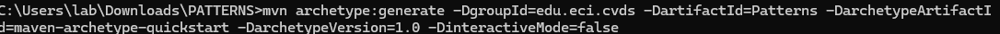

# PATTERNS - FACTORY
## Juan David Martinez
## Santiago Gualdron
## La Herramienta Maven
### Cuál es su mayor utilidad
Por medio de Maven podemos crear y gestionar proyectos 
basados en Java, reduciendo los procesos de compilacion
y poder compartir de manera mas sencilla un proyecto
### Fases de maven
Validar: si el proyecto es correcto y tenga toda la
información necesaria

Compilar: compilar codigo fuente del proyecto

Prueba: Utilizar pruebas unitarias adecuadas, las pruebas no deben 
requerir que el codigo este empaquetado o implementado

paquete: tomar el codigo compilado y empaquetarlo

prueba de integración: procesar e implementar el paquete

Verificar: comprobar que el paquete sea válido y cumpla con
criterios de calidad

instalar: instalar el paquete en el repositorio local, para usarlo como dependencia

implementar: Lanzamiento del proyecto, copia del paquete
final y se comparte

clean: limpia lo creado por compilaciones anteriores

sitio: generar documentacion del sitio para el proyecto

### Ciclo de vida de la construcción

### Para que sirven los plugins
Son complementos que añaden funcionalidades o apoyan un programa
### Qué es y para qué sirve el repositorio central de Maven

## CREAR UN PROYECTO CON MAVEN
Para crear un proyecto en maiven primero nos pararemos en la
carpeta en la cual lo vamos a crear con cd "ruta"
Luego vamos a creaamos el proyecto con el siguiente comando

Por lo que una carpeta "Patterns" sera creada, luego vamos a posicionarnos
sobre la carpeta.
Esta es la estructura de archivos en la carpeta, utilizando
"tree /f"

## AJUSTAR ALGUNAS CONFIGURACIONES EN EL PROYECTO

## Compilar y ejecutar
Por medio del comando "mvn package", compilamos el xml

package: al utilizar este comando pasamos a las fases de maven
compilacion,prueba y paquete creando la caperta target
### otros parametros para mvn
mvn clean: elimina la carpeta target, tambien se puede utilizar 
mvn clean install

mvn compile: compila las clases en target/classes

mvn test: Ejecuta las pruebas unitarias del directorio
src/test/java

mvn install: despues de compilar, ejecutar pruebas y empaquetar
el comando instala el archivo empaquetado en el repositorio local de Maven
(.m2/repository)

mvn deploy: parecido a "mvn install", pero este sube el archivo
a un repositorio local o remoto

mvn validate: valida estructura y configuraciones

mvn site: genera un sitio web estatico para el proyecto
(javaDoc)

### Ejecutar un proyecto maven 

